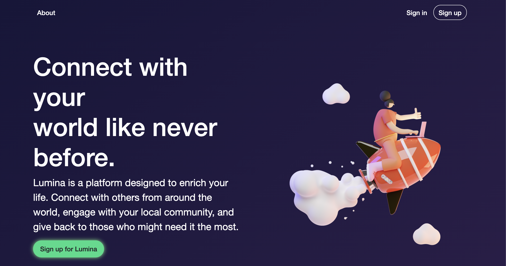

Rails app generated with [lewagon/rails-templates](https://github.com/lewagon/rails-templates), created by the [Le Wagon coding bootcamp](https://www.lewagon.com) team.


# Lumina

## About

Lumina is a social media platform that focuses on **kindness** and acts of **giving**.

*'Connect with your world like never before.'*
*'Lumina is a platform designed to enrich your life. Connect with others from around the world, engage with your local community, and give back to those who might need it the most.'*



This application was built with
```
Ruby on Rails, Javascript, HTML & CSS.
```

## Live site:

[Lumina](https://www.love-lumina.me/)

## Setup

If you would like to look at the code then clone the GitHub repository and change directory into `lumina`:
```
gh repo clone julianharr/lumina
```

You will also need Bundler installed:
```
bundle install
```
This will install the gems needed to run the program correctly.

## Navigating the application

You can create a new account with your email address and a password or alternatively you can log in our admin account with:

`user: spin@gmail.com`
`pass: 123456`


You will be presented with our never ending fully randomised feed! Feel free to add a status update:

[feed](docs/feed.png)

Navigate to your profile, events, charities and more!

[feed](docs/profile.png)

[feed](docs/charities.png)


You can add friends, and chat with them too!

[feed](docs/friends.png)

[feed](docs/chat.png)


## Technologies used

- Meetup API
- AJAX
- Friendable gem
- Postgres DB
- Bootstrap
- Mapbox/Geocoder
- Pundit

